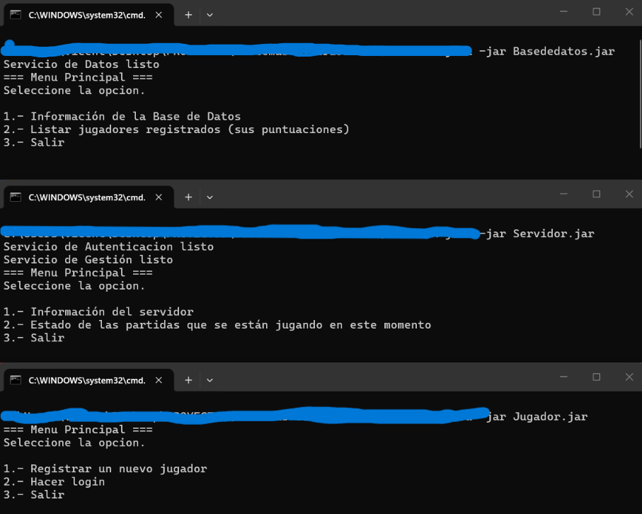
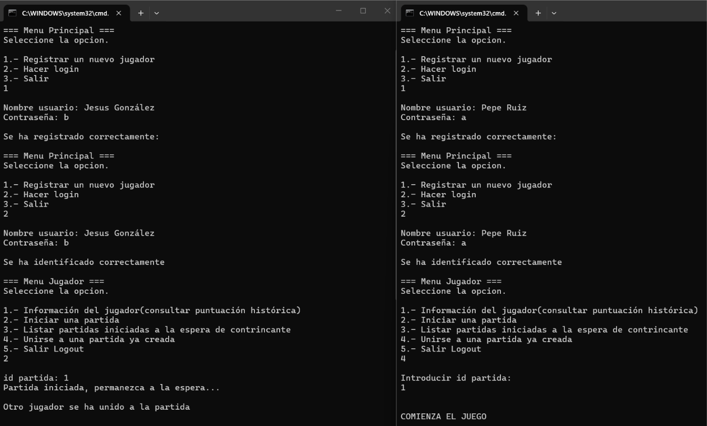
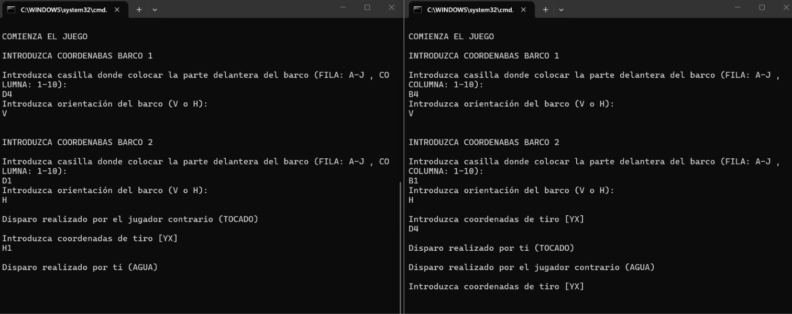

# Distributed Battleship Game with Java RMI

Distributed multiplayer Battleship game developed in Java using **Remote Method Invocation (RMI)**.

The project implements a distributed client-server architecture where multiple players can register, authenticate, create games, join existing matches and play against each other through remote services.

The system was originally developed as part of a Distributed Systems university project and has been reorganized and documented as a software engineering portfolio project.

---

## Features

- User registration and authentication
- Creation of multiplayer matches
- Joining available matches
- Battleship placement and coordinate validation
- Turn-based attacks between players
- Game state management
- Historical player scores
- Remote notifications using RMI callbacks
- Independent client, server and data-service components

---

## Architecture

The application is divided into four main modules:

```text
                       ┌──────────────────┐
                       │   RMI Registry   │
                       └────────┬─────────┘
                                │
                    ┌───────────┴───────────┐
                    │                       │
                    ▼                       ▼

              ┌─────────────┐        ┌─────────────┐
              │   Client 1  │        │   Client 2  │
              │   Player    │        │   Player    │
              └──────┬──────┘        └──────┬──────┘
                     │                      │
                     └──────────┬───────────┘
                                │
                                ▼
                         ┌──────────────┐
                         │  RMI Server  │
                         │              │
                         │Authentication│
                         │Game Manager  │
                         └──────┬───────┘
                                │
                                ▼
                         ┌──────────────┐
                         │ Data Service │
                         │              │
                         │ Users        │
                         │ Games        │
                         │ Scores       │
                         └──────────────┘
```

### Client

Responsible for player interaction.

Players can:

- Register an account
- Log into the system
- Create a new game
- List available games
- Join an existing game
- Place ships
- Perform attacks
- Receive game notifications

### Server

Contains the main application logic and coordinates communication between players.

The server exposes remote services including:

- Authentication service
- Game management service

### Data Service

Responsible for storing and providing access to:

- Registered users
- Active games
- Player information
- Game state
- Callbacks
- Historical scores

### Common

Contains the classes and interfaces shared between the distributed components.

These include:

- Remote service interfaces
- Player callback interface
- User model
- Game model
- Shared utilities
- Event management

---

## Java RMI

Communication between the different components is implemented using **Java Remote Method Invocation (RMI)**.

The application registers remote services in an RMI Registry and clients obtain remote references to interact with them.

Main remote services include:

```text
ServicioAutenticacion
ServicioGestor
ServicioDatos
```

This architecture allows the clients to invoke operations implemented on remote components as if they were local methods.

---

## RMI Callbacks

The project also implements callbacks so that the server can asynchronously notify connected players about events occurring during a game.

Examples include:

```text
Another player joined the game
Start of the game
Place your ships
Enter attack coordinates
Hit
Miss
Game won
Game lost
```

This enables bidirectional communication between clients and the server.

---

## Screenshots

### Distributed system startup

The system is composed of separate data-service, server and client processes.



### Multiplayer game creation

Two independent clients register and authenticate with the distributed system.

One player creates a game and waits for another player to join.

The second player lists the available games and joins the match.



### Multiplayer communication and RMI callbacks

Both players place their ships and start exchanging attacks.

The server coordinates the game and notifies each client of the result of the attacks through the distributed communication system.



---

## Project Structure

```text
distributed-battleship-java-rmi/

├── client/
│   └── src/
│
├── server/
│   └── src/
│
├── database/
│   └── src/
│
├── common/
│   └── src/
│
├── screenshots/
│   ├── system-startup.png
│   ├── multiplayer-game.png
│   └── rmi-callback.png
│
├── README.md
└── .gitignore
```

---

## Technologies

- Java
- Java RMI
- Distributed Systems
- Client-Server Architecture
- Remote Interfaces
- RMI Registry
- RMI Callbacks
- Object-Oriented Programming
- Distributed communication

---

## Concepts Practiced

This project explores several concepts related to distributed software systems:

- Remote procedure calls
- Client-server communication
- Distributed architectures
- Communication between independent processes
- Shared remote interfaces
- Bidirectional communication using callbacks
- Separation of responsibilities
- Distributed game-state management
- Authentication services
- Remote event notification

---

## Example Workflow

A typical game follows this sequence:

```text
Player 1                     Server                     Player 2
   │                           │                           │
   │──── Register ────────────►│                           │
   │                           │◄──────── Register ────────│
   │──── Login ───────────────►│                           │
   │                           │◄──────── Login ───────────│
   │──── Create game ─────────►│                           │
   │                           │◄──── Join game ───────────│
   │◄── Player joined ─────────│                           │
   │──── Place ships ─────────►│◄──── Place ships ────────│
   │──── Attack ──────────────►│                           │
   │                           │──── Notification ────────►│
   │◄──── Result ──────────────│                           │
```

---

## Possible Improvements

Some improvements that could be implemented in future versions include:

- Graphical user interface
- Persistent database storage
- Password hashing
- Improved exception handling
- Automated tests
- Maven or Gradle build system
- Dockerized deployment
- Structured logging
- Improved network security
- Configuration through external files
- Improved game-board visualization

---

## Academic Context

This project was originally developed as part of the **Distributed Systems** subject of the Computer Engineering degree.

The repository contains my implementation and has been reorganized and documented for portfolio purposes.
