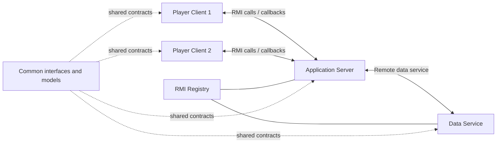

# Distributed Battleship Game with Java RMI

Multiplayer Battleship game implemented as a **distributed Java application using Java RMI (Remote Method Invocation)**.

The system is split into independent client, server, shared-interface and data-service modules. Players can register, authenticate, create or join matches, place ships, attack opponents and receive remote notifications through RMI callbacks.

> Originally developed as an academic Distributed Systems project and reorganized here as a software-engineering portfolio project.

## Features

- User registration and authentication
- Creation and discovery of multiplayer matches
- Joining existing matches
- Ship placement and coordinate validation
- Turn-based attacks between remote players
- Match state and score management
- Remote services exposed through Java RMI
- Server-to-client notifications using RMI callbacks
- Separation of client, server, data and shared contracts

## Architecture



### Client

Contains the player application and callback implementation. The client communicates with the server through remote interfaces and receives asynchronous game events from the server.

### Server

Hosts the main application logic and exposes remote services for authentication and game management.

### Data Service

Maintains users, matches, players, scores and other shared application state through a remote service.

### Common

Contains the interfaces and model classes shared by all distributed components, including:

- `ServicioAutenticacionInterface`
- `ServicioGestorInterface`
- `ServicioDatosInterface`
- `CallbackJugadorInterface`
- `Usuario`
- `Partida`
- `Eventos`

## Java RMI and callbacks

The project uses Java RMI so clients can invoke methods on services hosted in other JVMs. It also implements callback objects, allowing the server to invoke methods remotely on connected players and notify them of changes during a match.

Examples of events handled by the application include joining a match, starting a game, placing ships, attacking, hits, misses and match completion.

## Project structure

```text
distributed-battleship-java-rmi/
├── client/
│   └── src/es/uned/cliente/
├── server/
│   └── src/es/uned/servidor/
├── database/
│   └── src/es/uned/basededatos/
├── common/
│   └── src/es/uned/common/
├── screenshots/
├── .gitignore
└── README.md
```

## Technologies and concepts

- Java
- Java RMI
- Distributed systems
- Client-server architecture
- Remote interfaces
- RMI Registry
- Remote callbacks
- Object-oriented programming
- Distributed state management
- Inter-process/network communication concepts

## Main source files

### Client

- `Jugador.java` — main player application
- `CallbackJugadorImpl.java` — receives remote notifications from the server

### Server

- `Servidor.java` — server startup and service registration
- `ServicioAutenticacionImpl.java` — authentication service implementation
- `ServicioGestorImpl.java` — game-management service implementation

### Data service

- `BasedeDatos.java` — data-service startup
- `ServicioDatosImpl.java` — remote data-service implementation

## Running the project

This repository preserves the original Java RMI implementation while removing generated IDE/build artifacts. The source is organized into four modules that depend on the shared classes in `common`.

A future improvement would be to migrate the project to Maven or Gradle so compilation and startup can be reproduced with a single build configuration.

## Possible improvements

- Maven or Gradle multi-module build
- Persistent SQL database instead of in-memory state
- Secure password storage and stronger authentication
- TLS-protected communications
- Automated unit and integration tests
- Structured logging
- Improved exception handling
- Graphical client interface
- Docker-based deployment

## Academic context

The original implementation was created as part of a Distributed Systems subject in a Computer Engineering degree. This public version contains the implementation source code reorganized and documented for portfolio purposes; generated binaries, IDE metadata and original assignment material have been omitted.
